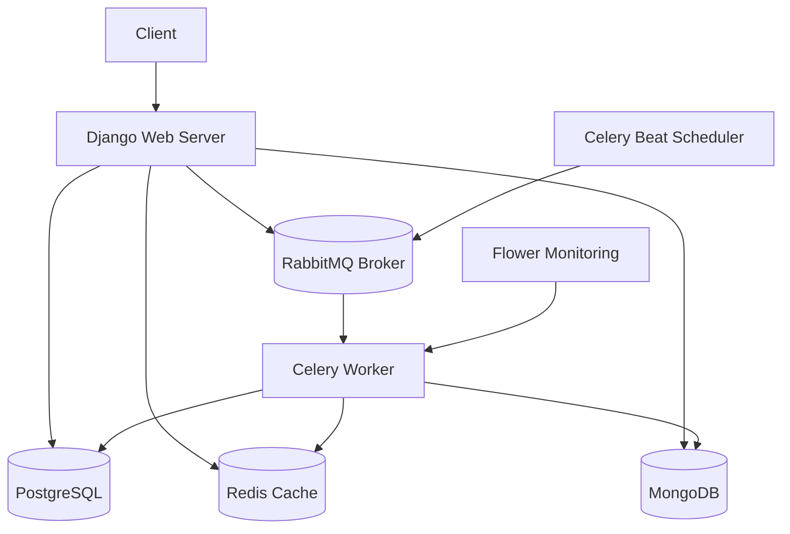

# Simple LMS Architecture

## Overview

This is a Django-based Learning Management System (LMS) with:
- Redis caching
- MongoDB for activity logs and analytics
- Celery for asynchronous tasks
- RabbitMQ as message broker
- Flower for Celery monitoring

## Architecture Diagram



## Services

### 1. Web (Django)
- Main application server
- Serves REST API endpoints
- Integrates with all services

### 2. PostgreSQL
- Primary database for course, user, enrollment data
- Stores relational data

### 3. Redis
- Caching layer for course list and details
- Rate limiting storage
- Celery result backend

### 4. MongoDB
- Activity logs collection: `activity_logs`
- Learning analytics collection: `learning_analytics`
- Document-based storage for flexible data

### 5. RabbitMQ
- Message broker for Celery
- Handles task queue management

### 6. Celery Worker
- Executes asynchronous tasks
- Processes tasks from RabbitMQ

### 7. Celery Beat
- Scheduled tasks
- Runs periodic tasks like `update_course_statistics`

### 8. Flower
- Web interface for monitoring Celery tasks
- Accessible at http://localhost:5555

## Caching Strategy

### Cache Keys
- `courses_list:<category_id>:<search>`: Course list cache (5 minutes)
- `course_detail:<course_id>`: Course detail cache (10 minutes)
- `rate_limit:<ip>`: Rate limiting counter (60 seconds)

### Cache Invalidation
- On course creation/update/deletion: delete all `courses_list:*` keys
- On course update/deletion: delete specific `course_detail:<id>` key

## Rate Limiting

- 60 requests per minute per IP address
- Uses Redis for storage
- Returns 429 Too Many Requests when limit exceeded

## Task Flow

### 1. Enrollment Email
```
User enrolls → API creates Enrollment → send_enrollment_email.delay()
→ RabbitMQ → Celery Worker → sends email
```

### 2. Generate Certificate
```
User completes course → generate_certificate.delay()
→ RabbitMQ → Celery Worker → logs to MongoDB
```

### 3. Update Course Statistics
```
Celery Beat (periodic) → update_course_statistics.delay()
→ RabbitMQ → Celery Worker → updates MongoDB analytics
```

### 4. Export Course Report
```
Trigger export → export_course_report.delay()
→ RabbitMQ → Celery Worker → generates CSV → logs to MongoDB
```

## Redis CLI Commands

```bash
# Connect to Redis
redis-cli -h localhost -p 6379

# List all cache keys
KEYS *

# Get cache value
GET "course_detail:1"

# Clear all cache
FLUSHDB

# Check rate limit for an IP
GET "rate_limit:127.0.0.1"
```

## Running the Application

```bash
# Build and start all services
docker-compose up --build

# Apply migrations
docker-compose exec web python manage.py migrate

# Create superuser
docker-compose exec web python manage.py createsuperuser
```

## Access Points

- API: http://localhost:8000/api
- API Docs: http://localhost:8000/api/docs
- Flower: http://localhost:5555
- RabbitMQ Management: http://localhost:15672 (guest/guest)
